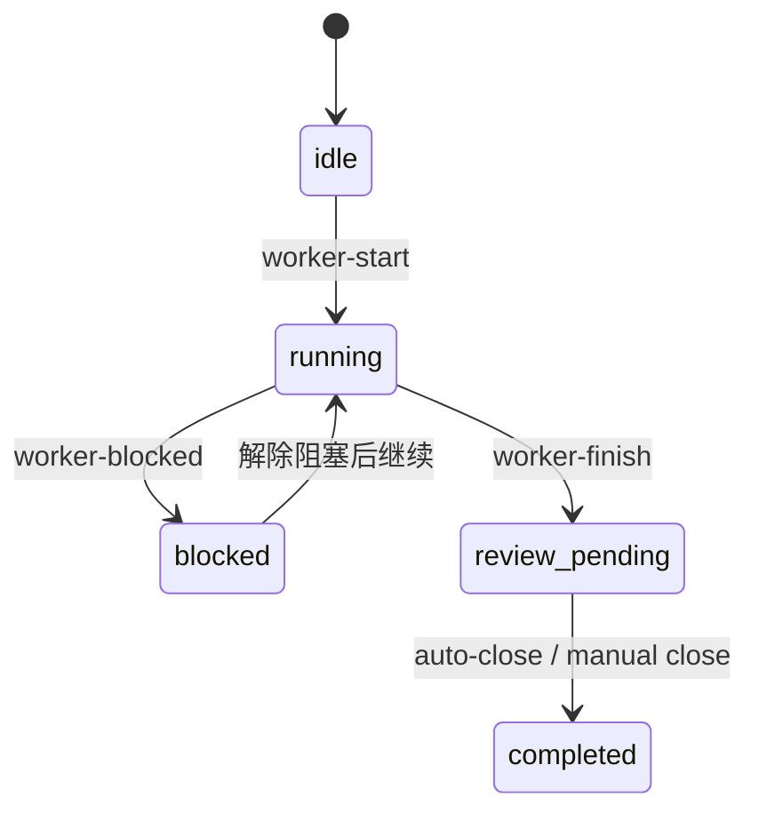

# AX9S Automation Operating Model

## 一期边界

- 一期的目标不是让系统自己决定做什么，而是让系统能可靠执行“已经定义清楚的任务”。
- 一期聚焦几小时级自动化，不追求全天无人值守。
- 一期允许自动关子任务与重试 cleanup，不自动切下一个父任务，不自动删父分支。

## 角色分工

### 协调器

- 读取 `CURRENT_TASK.yaml`、`TASK_REGISTRY.yaml`、`WORKTREE_REGISTRY.yaml`。
- 根据 `size_class`、`topology`、`automation_mode` 决定是否准备 execution worktree。
- 轮询 worker 状态。
- 触发 `auto-close-children`。
- 触发 `cleanup-orphans`。
- 在 blocked 或 cleanup 多次失败时升级到人工处理。

### Worker

- 只在授权目录内执行。
- 开始时调用 `worker-start`。
- 中途通过 `worker-report` 主动回报。
- 遇到共享保留区、依赖缺失、测试失败、边界不清时调用 `worker-blocked`。
- 完成候选交付时调用 `worker-finish`。

### Review / 集成责任

- 一期默认仍保留人工 review。
- `review_pending` 表示 worker 已完成候选交付，但尚未完成自动或人工关账。
- `completed` 仅表示任务已经收口完成。

## 状态流转

## 任务大小规则

- `micro`：不建 worktree；`planned_write_paths` 建议 `<=5`，硬上限 `8`。
- `standard`：默认单 worker；只有需要风险隔离、实验性实现或随时丢弃时才建 `1` 个 worktree。
- `heavy`：只有当 `planned_write_paths`、`required_tests`、`reserved_paths` 都能拆清，才允许并行；最多 `2` 个 execution worktree。

## automation_mode 触发规则

- `manual`：治理升级、共享保留区冲突、结构不清晰、首次接入模块或显式人工模式。
- `assisted`：边界清楚、测试明确的 `micro / standard` 任务。
- `autonomous`：模块地图完整、测试完备、边界清楚并满足并行前提的任务。

## runner 行为

- `manual`：只跑 `check_repo.py`、`check_hygiene.py` 和 `cleanup-orphans`；跳过 prepare / auto-close。
- `assisted`：可准备 execution worktree，但不会自动 `auto-close-children`。
- `autonomous`：可准备 execution worktree，并在门禁满足时自动 `auto-close-children`。

## blocked 条件

- 触碰共享保留区。
- 依赖不满足。
- 目标边界不清。
- 测试失败且无法在当前边界内修复。
- `heavy` 并行拆分条件不成立。

## auto-close 条件

- worker 已进入 `review_pending`。
- runlog 中已经登记 required tests。
- 未触发共享保留区冲突。

## cleanup 规则

- `cleanup_state=pending`：待清理。
- `cleanup_state=blocked`：自动清理失败，但仍可重试。
- `cleanup_state=blocked_manual`：自动重试达到上限，必须人工接管。
- `cleanup_state=done`：清理完成。

重试规则：

- 最多自动重试 `3` 次。
- 达到上限后转 `blocked_manual`。
- 不强杀系统进程，不自动关闭桌面窗口。

## 人工接管条件

- 任务进入 `manual` 模式。
- cleanup 达到 `blocked_manual`。
- 当前任务需要修改共享保留区。
- required tests 无法满足。
