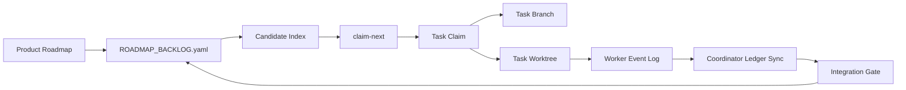

# Modular Roadmap Scheduler Design

## Status

- Task: `TASK-GOV-038`
- Stage: `governance-modular-roadmap-scheduler-design-v1`
- Status: design baseline
- Authority: `docs/product/AUTHORITY_SPEC.md`, `docs/governance/OPERATOR_MANUAL.md`, `docs/governance/MODULE_MAP.yaml`, `docs/governance/TASK_POLICY.yaml`

## Goal

Build a governance-level scheduler so multiple Codex windows can all issue `持续按路线图开发` and quickly receive safe, non-conflicting work.

The scheduler must:

- Treat the product roadmap as a module DAG, not as one linear task queue.
- Split stages 1-9 into parent routes and claimable child lanes.
- Prefer independent module or same-stage child work when safe.
- Force integration gates when contracts, facts, customer-visible delivery, or shared paths meet.
- Prevent ledger, runlog, branch, worktree, checkpoint, push, and PR collisions.
- Allow stale task takeover only when the takeover is safe and auditable.

## Non-Goals

- Do not change business logic in `src/`.
- Do not change `stage6_facts` behavior, fact refresh, or write-back policy.
- Do not change public API contracts, database schema, customer-visible field allowlists, or region/source coverage.
- Do not implement the full scheduler in this design task.
- Do not let AI infer routes directly from historical tasks or absorbed work.

## Control Model



`claim-next` is the only entrypoint for automatic route selection. A window must not decide its own task by scanning historical docs.

## Stage DAG

The stage DAG remains authoritative:

```text
stage1_orchestration
-> stage2_ingestion
-> stage3_parsing
-> stage4_validation
-> stage5_reporting
-> stage6_facts
-> stage7_sales
-> stage8_contact
-> stage9_delivery
```

`stage7_sales` and `stage8_contact` can run in parallel after `stage6_facts` exposes a stable `project_fact` contract. `stage9_delivery` waits for `stage6_facts`, `stage7_sales`, and `stage8_contact` integration readiness.

## Lane Types

Every roadmap item must declare one lane type:

| Lane Type | Purpose | Parallel Policy |
|---|---|---|
| `core_contract` | Freeze a stage input/output contract, fixture shape, and path boundary. | Single writer. |
| `stage_internal_parallel` | Implement independent same-stage slices by source family, parser family, rule topic, formatter, or fixture set. | Parallel when paths are disjoint. |
| `downstream_fixture_preview` | Let a downstream stage build skeletons/tests against frozen fixtures. | Parallel, but cannot change upstream contracts. |
| `integration_gate` | Merge child outputs, run contract and integration checks, unlock downstream lanes. | Single writer. |
| `fact_surface_gate` | Update or validate the stage6 fact surface. | Strict single writer. |

## Stage 1-9 Decomposition

| Stage | Core Contract | Internal Parallel Lanes | Gate |
|---|---|---|---|
| `stage1_orchestration` | Job contract, scheduling state, source request shape. | Source-family scheduling, retry behavior tests, job fixtures. | Freeze ingestion job fixture. |
| `stage2_ingestion` | Raw payload contract, source metadata, capture policy. | Source-family connectors, payload fixtures, source coverage metadata. | Freeze raw payload fixture. |
| `stage3_parsing` | Normalized record schema, parse error semantics, traceability. | Parser families, normalization slices, parse failure samples. | Freeze normalized records. |
| `stage4_validation` | `rule_hit` contract, topic boundaries, validation I/O. | Rule topics, evidence matching, rule fixtures, boundary regressions. | Freeze validated findings. |
| `stage5_reporting` | Report artifact contract, internal report sections, snapshot policy. | Formatters, report fragments, objection-pack drafts, snapshots. | Freeze report artifacts. |
| `stage6_facts` | `project_fact` aggregation and fact refresh contract. | Read-only tests, fixture validation, docs and contract checks. | Strict fact surface gate. |
| `stage7_sales` | `sales_context` contract consuming `project_fact`. | Opportunity tags, sales explanation text, non-legal-claim guards. | Freeze sales context. |
| `stage8_contact` | `contact_context` contract and person/entity boundary. | Contact leads, PII guard tests, entity match fixtures, source maturity guards. | Freeze contact context. |
| `stage9_delivery` | Delivery payload contract and customer-visible boundary. | Export/API payloads, allowlist/blacklist checks, sellable guards. | Final customer-visible delivery gate. |

## Claim Rules

`claim-next` must evaluate candidates in this order:

1. Refresh live ledgers and active worktree registry.
2. Acquire scheduler lock.
3. Rebuild or refresh the candidate index.
4. Exclude blocked, absorbed, historical, closed, or already claimed candidates.
5. Exclude candidates whose dependencies or gates are not satisfied.
6. Exclude candidates whose `planned_write_paths` overlap active tasks.
7. Exclude candidates that hit another task's `reserved_paths`.
8. Exclude candidates that would share a `single_writer_root`.
9. Exclude candidates whose branch or worktree is already owned by another active task.
10. Prefer safe stale takeover candidates before creating new lower-priority work.
11. Score remaining candidates by priority, dependency value, lane type, and test cost.
12. Write the claim atomically and return the selected task package.

If no candidate is safe, the command must return a deterministic blocker with the top wait reason.

## Conflict Locks

The scheduler owns these locks:

| Lock | Scope | Rule |
|---|---|---|
| `scheduler_lock` | Candidate refresh and claim writes. | One writer at a time. |
| `ledger_lock` | `CURRENT_TASK`, `TASK_REGISTRY`, `WORKTREE_REGISTRY`. | Coordinator writes only. |
| `runlog_lock` | Formal runlog append. | Coordinator appends from worker event logs. |
| `branch_lock` | Task branch name. | One task per branch. |
| `worktree_lock` | Worktree path. | One task per worktree. |
| `write_path_lock` | `planned_write_paths`. | Disjoint required for parallel execution. |
| `single_writer_root_lock` | High-risk roots. | Single active writer per root. |
| `publish_lock` | Commit, push, PR for one task branch. | Only review/done tasks pass. |

## Worker Logs

Workers must not concurrently write shared formal runlogs. A worker writes a task-scoped event log first. The coordinator later syncs a formal runlog entry under lock.

Minimum worker event fields:

- `task_id`
- `branch`
- `worktree_path`
- `worker_session_id`
- `event_type`
- `event_at`
- `summary`
- `dirty_paths`
- `tests_run`
- `next_action`

## Stale Takeover

Task takeover uses heartbeat and dirty-state checks:

| State | Action |
|---|---|
| Heartbeat fresh. | Do not take over. Pick another candidate. |
| Heartbeat stale and worktree clean. | Reclaim task and continue. |
| Heartbeat stale and dirty paths are within `planned_write_paths`. | Create checkpoint, then reclaim. |
| Heartbeat stale and dirty paths include out-of-scope paths. | Block and require human decision. |
| Branch exists and worktree is missing. | Recreate worktree if branch is not diverged. |
| Remote branch has unknown commits. | Block. Never force push automatically. |

The default stale threshold remains governed by `HANDOFF_POLICY.yaml`.

## Publish Rules

Automatic publish is separate from checkpointing:

- Running tasks may checkpoint only task-scoped dirty paths.
- Push and PR creation require `review` or `done`.
- Publish preflight must validate required tests, ledger consistency, dirty paths, remote, auth, and duplicate PR state.
- Push must not use force.
- Diverged branch state must create a blocker or integration task.
- Integration tasks, not ordinary workers, merge module outputs into a shared base.

## Candidate Schema Summary

The detailed schema is defined in `docs/governance/ROADMAP_BACKLOG_SCHEMA.yaml`.

Minimum candidate fields:

- `candidate_id`
- `title`
- `stage`
- `module_id`
- `lane_type`
- `status`
- `priority`
- `depends_on`
- `unlocks`
- `allowed_dirs`
- `reserved_paths`
- `planned_write_paths`
- `planned_test_paths`
- `required_tests`
- `branch_template`
- `worktree_template`
- `integration_gate`
- `claim_policy`
- `takeover_policy`

## Implementation Plan

| Task | Goal | Writes |
|---|---|---|
| `TASK-GOV-038` | Freeze design, schema, and initial 1-9 backlog skeleton. | `docs/governance/` |
| `TASK-GOV-039` | Add backlog parser and candidate index generator. | `docs/governance/`, `scripts/`, `tests/governance/` |
| `TASK-GOV-040` | Add `claim-next`, claim locks, branch/worktree conflict checks, stale takeover preflight. | `scripts/`, `tests/governance/`, `tests/automation/` |
| `TASK-GOV-041` | Route `持续按路线图开发` into `claim-next` and automation runner. | `scripts/`, `docs/governance/`, `tests/automation/` |
| `TASK-GOV-042` | Add integration gate and publish-lock regression coverage. | `scripts/`, `docs/governance/`, `tests/governance/`, `tests/automation/` |

## Acceptance Criteria

- Multiple windows can claim different ready child lanes without sharing branches or worktrees.
- Candidate selection is deterministic and does not rely on historical task inference.
- Stage 1-6 main-chain contracts remain ordered and do not bypass `stage6_facts`.
- Same-stage child lanes can run in parallel only after their `core_contract` gate is satisfied.
- `stage6_facts` main surface remains strict single writer.
- Stale takeover has clear allow/block outcomes.
- Publish never overwrites a remote branch or creates duplicate PRs automatically.
- Integration gates are the only mechanism for cross-module merge points.
